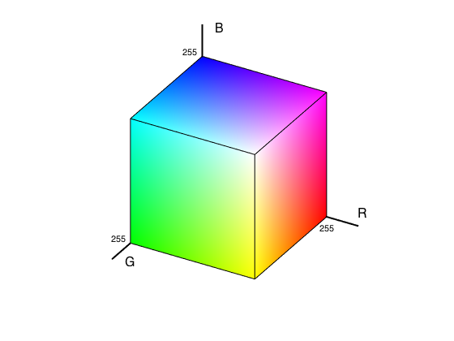

# What's the big Deal?

Do you have 5,000 pictures on your phone? Do you wish that you could fold, or squish them so that you fit more? well we can use some statistical **magic** to do just that!

# How does it work?

A pixel typically takes up 3 bytes of data: 1 byte for the R,G,and B values which make up the color. But the truth is we don't actually need all that space. Colors are sparse: most of them never get used.Insead of getting 3x256 possible colors, we can get away with just k colors.

# Sparse Colors

We can achieve this by conceptualizing the color domain as a 3D euclidean space where the axes are the color channels: 

Then we use k-means clustering to find k pixel clusters

# EM Algorithm

to this point, we have assumed that the colors are independent from one another. that is, it follows k independent normal distributions.  