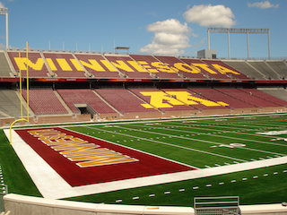

# Image Compression using EM and K-means

## What's the big Deal?

Do you have 5,000 pictures on your phone? Do you wish that you could fold, or squish them so that you fit more? well we can use some statistical **magic**  to achieve image compression without significant loss in quality.

## How does it work?

A pixel typically takes up 3 bytes of data: 1 byte for the R,G,and B values which make up the color. But the truth is we don't actually need all that space. Colors are sparse: most of them never get used. Insead of getting 3x256 possible colors, we can get away with just k colors.

 

Would you belive that the image on the right is 1,000 times smaller than the image on the left? Well, it's true: because it uses only 16 colors.

## K Means

We can achieve this by conceptualizing the color domain as a 3D euclidean space where the axes are the color channels: 

Then we plot all the pixels and use k-means clustering to find k clusters

## EM Algorithm

to this point, we have assumed that the colors are independent from one another. that is, it follows k independent normal distributions. However we use the EM algorithm to account for correlation between the different distributions. 

The expectation step will calulate the "responsibility" of each pxiel to its cluster, or the probability that the pixel belongs to each cluster. 

in the maximization step, we then update the covariance matrix of the multivariate distribution to maximize the probability that these pixels exist this way.

After iterating the EM steps, we will account for dependence between color clusters.

## Getting Started 

To run this image compression project, follow the steps below:

- Clone the repository: git clone https://github.com/Dan-Swarts/Image_Compression.git
- Install the required dependency: pip install scikit-image
- Run the main compression script: python main.py --input <input_image_path> --k <num_colors> --output <output_image_path>
- Feel free to experiment with different values of num_colors (k) to achieve the desired level of compression.